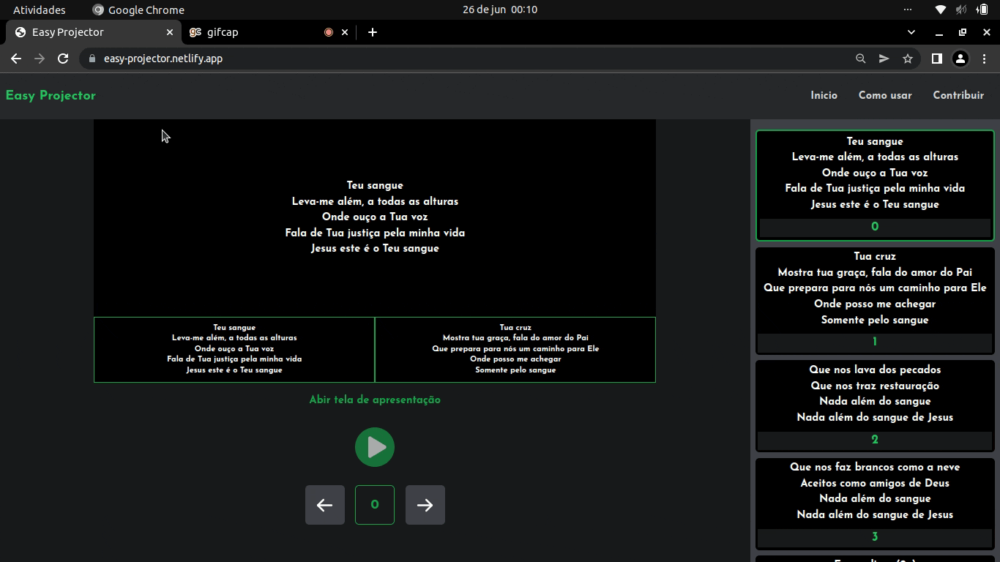

<div>

</div>


# Easy Projector

A ferramenta que vai tornar a reprodução de musicas no retro projetor muito mais simples e prática


[](https://github.com/tterb/atomic-design-ui/blob/master/LICENSEs)

[]()
## Utilidade

 O Easy Projector foi desenvolvido com o intúito de ajudar igrejas a fazer apresentaçãos de letras de musicas de forma simples e prática. Com o Easy Projector o usuários consegue reproduzir a letra da musica utilizando apenas o link dela que ele pode facilmente conseguir fazendo uma simples pesquisa no site [vagalume.com.br](https://www.vagalume.com.br/), torando obsoleta a prática de guardar milhares de arquivos PowerPoint em sue computador.
## Demonstração

Teste clicando [aqui](https://easy-projector.netlify.app/)

### Atenção:
Este projeto foi efeito exclusivamento para uso em modo desktop,
sendo assim não possue nenhum tipo de responsividade.


## Screenshots

### Passo 1:
Abra o site e pesquise a letra que deseja reproduzir


### Passo 2:
Selecione a letra, copie o link,volte a aba do Easy Projector, cole o link e em seguida aperte play.


### Passo 3:
Clicke em abrir apresentação, isso irá abrir uma aba ao lado onde a letra será mostrada, arraste a aba tornando uma nova instancia do navegador com no exemplo abaixo 


### Passo 4:
Em seguida puxe a nova janela para a tela ao lado (a tela a lado será o retro projetor),
após isso maximize a ja nela na tela e aperte a tecla F11:


### Passo 5:
Pronto, agora vc esta pronto para reproduzir a letra, utilize as teclas direcionais do teclado para prosseguir ou retornar a uma determinada parte da letra, para pausar a reprodução utilize a tecla **espaço**, para encerrar a reprodução utilize a tecla **Esc**.



## Funcionalidades

- Atalhos do Teclado
- Play e Pause reprodução


## Melhorias

* Exibição da Bíblia
* Exibição de textos do usuário
* Compatibilidade com site letras.mus.br
## Autores

- [@Jonathan Santos](https://github.com/Jonaathan-Santos)


## Rodando localmente

Clone o projeto

```bash
  git clone https://github.com/Jonaathan-Santos/Easey-Projector.git
```

Entre no diretório do projeto

```bash
  cd easy-projector
```

Instale as dependências

```bash
  npm install
```

Inicie o servidor

```bash
  npm run dev
```


## Stack utilizada

**Front-end:**  
* TailwindCSS
* React (Vite)
* React-Router-Dom
* cheerio (web scraping)
* Typescript 


